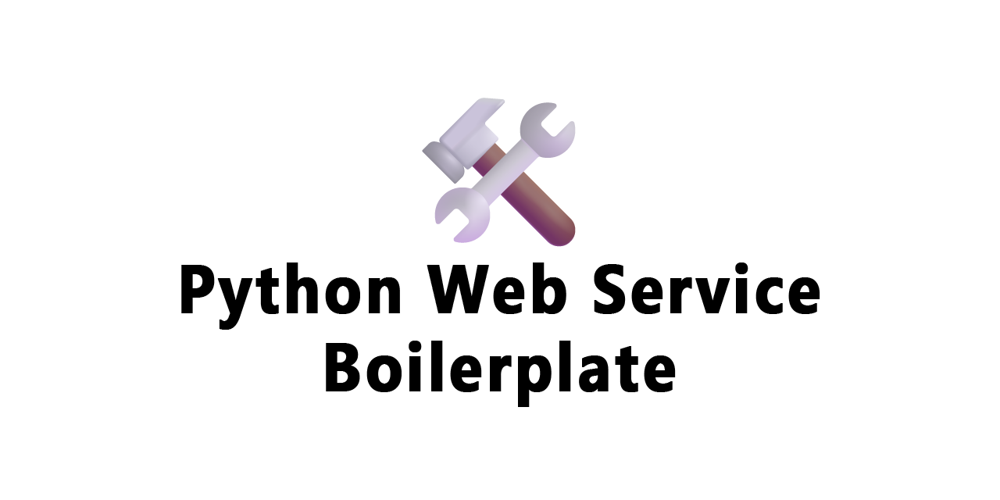

[](https://github.com/johnnymillergh/python-web-service-boilerplate/releases)
[](https://github.com/johnnymillergh/python-web-service-boilerplate/actions)
[](https://github.com/johnnymillergh/python-web-service-boilerplate/issues)
[](https://github.com/johnnymillergh/python-web-service-boilerplate/network)
[](https://github.com/johnnymillergh/python-web-service-boilerplate)
[](https://github.com/johnnymillergh/python-web-service-boilerplate/blob/main/LICENSE)
[](https://github.com/johnnymillergh/python-web-service-boilerplate)
[](https://github.com/johnnymillergh/python-web-service-boilerplate)
[](https://x.com/intent/tweet?text=Wow:&url=https%3A%2F%2Fgithub.com%2Fjohnnymillergh%2Fpython-web-service-boilerplate)

# Python Web Service Boilerplate

**python_web_service_boilerplate** is a boilerplate project for Python web service. Based on template [sourcery-ai/python-best-practices-cookiecutter](https://github.com/sourcery-ai/python-best-practices-cookiecutter).

[Docker Image](https://github.com/johnnymillergh?tab=packages&repo_name=python-web-service-boilerplate)

## Features

Here are the highlights of **python_web_service_boilerplate**:

### Core Framework

* FastAPI - Modern, fast web framework for building APIs
* Uvicorn - ASGI server for FastAPI

- Python 3.13 [](https://www.python.org/downloads/release/python-3131/) - Latest Python version support
- Poetry - Dependency management and packaging

### Database & ORM

* SQLModel (SQLAlchemy) with async support
* Alembic - Database migration tool
* PostgreSQL support via psycopg3 and asyncpg
* SQLite support via aiosqlite
* JSON serialization with orjson for performance

### Data Processing & Analysis

* Pandas - Data manipulation and analysis
* NumPy - Numerical computing
* Matplotlib - Data visualization

### Configuration & Utilities

- Pydantic - Data validation using Python type hints
- Pyhocon - Configuration management with environment variable support
- Loguru - Advanced logging
- Arrow - Better date/time handling
- Tenacity - Retry functionality
- APScheduler - Job scheduling

### Development Tools

- MyPy - Static type checking
- Ruff - Fast Python linter and formatter
- Pre-commit - Git hooks for code quality

### Testing Framework

* Pytest with multiple plugins:
  * pytest-mock - Mocking support
  * pytest-cov - Code coverage analysis
  * pytest-html - HTML test reports
  * pytest-xdist - Parallel test execution
  * pytest-asyncio - Async test support
  * pytest-benchmark - Performance benchmarking
  * pytest-monitor - Test monitoring

   ```
   2025-08-28 22:02:41.175 | ℹ️ INFO     | 12092 | MainThread      | Trace= | python_web_service_boilerplate.__main__.startup:57 - Starting python_web_service_boilerplate using Python 3.13.7 on JMLegionRen9000 with PID 12092 (D:\Projects\PyCharmProjects\python-web-service-boilerplate\src\python_web_service_boilerplate)
   2025-08-28 22:02:41.302 | ℹ️ INFO     | 12092 | MainThread      | Trace= | logging.callHandlers:1737 - sqlalchemy.engine.Engine -> ROLLBACK
   2025-08-28 22:02:41.302 | ℹ️ INFO     | 12092 | MainThread      | Trace= | python_web_service_boilerplate.__main__.startup:78 - Started python_web_service_boilerplate@0.1.0 in 0:00:00.127830
   ```

## Usage

1. Clone or download this project.

   ```shell
   $ git clone https://github.com/johnnymillergh/python_web_service_boilerplate.git
   ```

2. Build with the newest PyCharm.

3. Click the green triangle to Run.

## Setup

1. Setup the development environment

   ```shell
   # Install pipx if not installed
   $ python3 -m pip install pipx
   $ python3 -m pipx ensurepath

   # Install poetry using pipx, https://python-poetry.org/docs/#installing-with-pipx
   $ pipx install poetry
   ```

2. Install dependencies, with optional dependency group `test`

   ```shell
   $ poetry install --with test
   ```

3. Install mypy types

   ```shell
   $ poetry run mypy --install-types
   ```

4. Setup pre-commit and pre-push hooks

   ```shell
   $ poetry run pre-commit install -t pre-commit
   $ poetry run pre-commit install -t pre-push
   ```

5. Start up the application

   ```shell
   $ fastapi dev src/python_web_service_boilerplate/__main__.py
   ```

## Useful Commands

### Run Python Module

```shell
$ poetry env activate
$ python3 -m python_web_service_boilerplate
$ uvicorn python_web_service_boilerplate.__main__:app --host localhost --port 8080 --reload
```

### Run Python Script

**Append your project’s root directory to** `PYTHONPATH` — In any environment you wish to run your Python application such as Docker, vagrant or your virtual environment i.e. in bin/activate, run the below command:

> [How to Fix ModuleNotFoundError and ImportError](https://towardsdatascience.com/how-to-fix-modulenotfounderror-and-importerror-248ce5b69b1c)

For macOS or Linux,

```shell
# Ensure `pwd` is the root directory of the project
$ PYTHONPATH=`pwd` poetry run python3 python_web_service_boilerplate/demo/pandas_usage.py
$ PYTHONPATH=`pwd` poetry run python3 python_web_service_boilerplate/demo/multithread_and_thread_pool_usage.py

# Run the main module
$ PYTHONPATH=`pwd` poetry run python3 python_web_service_boilerplate/__main__.py

# Run a pytest script
$ pytest --log-cli-level=DEBUG --capture=no tests/common/test_debounce_throttle.py

# Run a pytest script with `-k` EXPRESSION
$ pytest --log-cli-level=DEBUG --capture=no tests/common/test_debounce_throttle.py -k 'test_debounce'

# For more details of pytest command
$ poetry run pytest --help
```

For Windows Terminal,
```powershell
# Ensure `$PWD.Path` is the root directory of the project
$ $env:PYTHONPATH=$PWD.Path; poetry run python .\python_web_service_boilerplate\demo\pandas_usage.py
$ $env:PYTHONPATH=$PWD.Path; poetry run python .\python_web_service_boilerplate\demo\multithread_and_thread_pool_usage.py

# Run the main module
$ $env:PYTHONPATH=$PWD.Path; poetry run python .\python_web_service_boilerplate\__main__.py
```

### Run Unit Tests

Run with pytest, analyze code coverage, generate HTML code coverage reports, fail the test if coverage percentage is under 90%,

```shell
$ poetry run pytest --cov --cov-report html --cov-fail-under=85 --capture=no --log-cli-level=INFO
```

Benchmark with pytest,

```shell
$ poetry run pytest --capture=no --log-cli-level=ERROR -n 0 --benchmark-only
```

### Conventional Changelog CLI

1. Install global dependencies (optional if installed):

   ```shell
   $ npm install -g conventional-changelog-cli
   ```

2. This will *not* overwrite any previous changelogs. The above generates a changelog based on commits since the last semver tag that matches the pattern of "Feature", "Fix", "Performance Improvement" or "Breaking Changes".

   ```shell
   $ conventional-changelog -p angular -i CHANGELOG.md -s
   ```

3. If this is your first time using this tool and you want to generate all previous changelogs, you could do:

   ```shell
   $ conventional-changelog -p angular -i CHANGELOG.md -s -r 0
   ```

### Check Versions of Python Packages

```shell
$ poetry run pip list --outdated
```

Output be like,

```
Package           Version  Latest    Type
----------------- -------- --------- -----
alembic           1.16.4   1.16.5    wheel
fonttools         4.59.1   4.59.2    wheel
orjson            3.11.2   3.11.3    wheel
pefile            2023.2.7 2024.8.26 wheel
pip               25.1.1   25.2      wheel
platformdirs      4.3.8    4.4.0     wheel
pre_commit        4.0.1    4.3.0     wheel
pydantic_core     2.33.2   2.39.0    wheel
pytest            8.3.4    8.4.1     wheel
pytest-asyncio    0.25.1   1.1.0     wheel
pytest-cov        6.0.0    6.2.1     wheel
pytest-mock       3.14.0   3.14.1    wheel
pytest-xdist      3.6.1    3.8.0     wheel
ruff              0.8.6    0.12.11   wheel
starlette         0.47.2   0.47.3    wheel
typing_extensions 4.14.1   4.15.0    wheel
```

## CI (Continuous Integration)

- GitHub Actions are for building projects and running tests.
- ~~[Travis CI](https://travis-ci.com/github/johnnymillergh/) is for publishing Docker Hub images of SNAPSHOT and RELEASE.~~

## FAQ

1. [ExecutableNotFoundError: Executable `/bin/bash` not found when using pre-commit](https://stackoverflow.com/questions/72321412/bin-bash-not-found-when-using-pre-commit)

   **Solution**: delete `.git/hooks/pre-commit.legacy` and then reinstall, also deleted `.git/hooks/pre-commit` just to be sure before installing again.

2. Installing all stub type packages,

   ```shell
   $ mypy --install-types
   ```

## Maintainers

[@johnnymillergh](https://github.com/johnnymillergh).

## Contributing

Feel free to dive in! [Open an issue](https://github.com/johnnymillergh/python_web_service_boilerplate/issues/new).

### Contributors

This project exists thanks to all the people who contribute.

- Johnny Miller [[@johnnymillergh](https://github.com/johnnymillergh)]
- …


### Sponsors

Support this project by becoming a sponsor. Your logo will show up here with a link to your website. [[Become a sponsor](https://become-a-sponsor.org)]

## Credits

This package was created with Cookiecutter and the [sourcery-ai/python-best-practices-cookiecutter](https://github.com/sourcery-ai/python-best-practices-cookiecutter) project template.

Inspired by [How to set up a perfect Python project](https://sourcery.ai/blog/python-best-practices/).

## License

[Apache License](https://github.com/johnnymillergh/python_web_service_boilerplate/blob/main/LICENSE) © Johnny Miller

2025—Present
